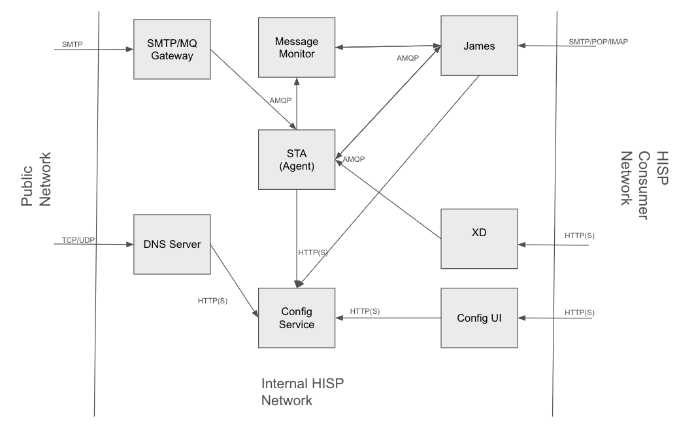

# Cloud Native HISP Deployment Model

The cloud native model consists of smaller individual processes (i.e. micro-services) performing specific functional tasks and exposing APIs
either via REST or asynchronous messaging interfaces.  Generally the REST interfaces are used to retrieve and maintain the system's configuration
data while the messaging interfaces are used to move Direct messages from one processing step to another using a streaming/pipelining paradigm.

Each micro-service is a discrete Spring Boot fat jar application and be deployed on multiple platforms ranging from bare metal systems to highly
managed cloud provider runtimes such as Google Cloud Run.  This document provides details on how to launch each micro-service as a stand alone Java process,
however each micro-service can be deployed using any number of options such as Docker, CloudFoundry, Kubernetes, Google Cloud Run, etc.  Instructions
for each targeted platform are out of the scope for this document as they may incur additional platform specific steps such as containerization.

In addition, this deployment model uses asynchronous messaging to dispatch Direct messages from processing stage to the next.  The deployment requires
the deployment of a messaging system such as RabbitMQ or Kafka (the default deployment model uses RabbitMQ).

The following is the list of micros-service making up the core of the reference implementation deployment

* Configuration Service
* Configuration UI
* Message Monitor
* SMTP/MQ Gateway
* Security and Trust Agent
* Apache James (for message sending/retrieving and last mile delivery only) 
* XD 

## Topology Overview

The following rough diagram illustrates the micro-services in the cloud native deployment model and how they communication with each other.
For simplicity, supporting services like the RabbitMQ and databases have been removed from the diagram, but they generally exist within
the internal HISP network. 




It's worth noting early that unlike the legacy deployment model, the cloud native model does utilize two different SMTP servers: an external facing server for
receiving messages from other HISPs and an internal server for last mile delivery, message storage at rest, and sending out bound messages.

## Micro-Services List

The following list outlines each micro-service, the jar file that comprises the services (each is a single SpringBoot fat jar), and a description of the service.

| Service | Jar File | Description |
| :---         | :---           | :---          |
| Config Sevice     | [config-service.jar](https://repo.maven.apache.org/maven2/org/nhind/config-service/8.1.0/config-service-8.1.0.jar) | Holds configuration service for the HISP such as domains, DNS entries, trust bundles, and certificates.  |
| Config UI         | [config-ui.war](https://repo.maven.apache.org/maven2/org/nhind/config-ui/8.1.0/config-ui-8.1.0.war) | Front end web UI application to configure the HISP including domains, DNS enttires, trust bundles, and certificates.  |
| Message Monitor   | [direct-msg-monitor-sboot.jar](https://repo.maven.apache.org/maven2/org/nhind/direct-msg-monitor-sboot/8.1.0/direct-msg-monitor-sboot-8.1.0.jar) | Tracks the status of notifications of Direct messages and generates error messages if required notifications are not received.  Notification statuses are sent from other micro-services (STA and James) via the message broker (eg. RabbitMQ) |
| SMTP/MQ Gateway   | [direct-smtp-mq-gateway.jar](https://repo.maven.apache.org/maven2/org/nhind/direct-smtp-mq-gateway/8.1.0/direct-smtp-mq-gateway-8.1.0.jar) | Externaly facing SMTP server intented to receive Direct messages from external HISPs.  It forwards Direct messgaes into the message processing stream via the system's message broker.  **NOTE**  This SMTP server does not providce comercial capability such as anti spam filters or malware detection.  It may be advisable to front this SMTP server by a commercial SMTP if you have needs for commercial capabilities to control of incoming messages.  |
| Security and Trust Agent | [direct-sta-sboot.jar]([config-service-8.1.0.jar](https://repo.maven.apache.org/maven2/org/nhind/direct-sta-sboot/8.1.0/direct-sta-sboot-8.1.0.jar)) | Executes the main security and trust agent logic as define the Direct specification.  Also handlels processing XD stepping and forwarding processed messages to either external HISPs or internal final destination depending of the sender and receiver of the messages.  Internal final destination are either the James server application or XD endpoints. |
| Apache James      | [direct-james-server](https://repo.maven.apache.org/maven2/org/nhind/direct-james-server/8.1.0/direct-james-server-8.1.0.jar) | Mail server for HISP end users.  It allows end user to send and receive messages using mail clients meaning it is a final destination for incoming Direct messages.  It also handles sending MDN dipatched messages when requested by the oroginal sender.  Outgoing and incoming messages are send to and from the STA via the message broker. |
| XD                | [xd.war](https://repo.maven.apache.org/maven2/org/nhind/xd/8.1.0/xd-8.1.0.war) | Implements an XD endpoing for the purpose of end users sending outgoing messages using the XDR protocol.  Outgoing and messages are send to and from the STA via the message broker.  |

## Deploymen RabbitMQ

The cloud native deployment implements an asynchrous messaging paradigm to move messages from one micro-service to the next which requires the introduction of a message broker.  The default broker used by the reference implemenation is RabbitMQ.

There are serveral options for deploying RabbitMQ from multiple sources both using commercial and open source offerings.  The RabbitMQ documentation provides a good [instructions](https://www.rabbitmq.com/docs/download#open-source-rabbitmq-server) 
for installing a multitude of options.  For simplicity sake, an easy option is simply deploy RabbitMQ using a docker container with the following command:

```
docker run -it --rm --name rabbitmq -p 5672:5672 -p 15672:15672 rabbitmq:4-management
```

This will run RabbitMQ with both the broker and management components with a user/password of guest/guest (which are the default credentials used by the Direct micro-services).

## Download Micro-service Binaries

The deployment in this documentation will download each micro-service jar/war file from maven and place each in its own directory.  You will effectively just be running the micro-services as simple java applicatoions on bare metal machine.

Obtain each jar/war file from maven and place each into own directory on your target machine.  The table below lists each micro-service along with a link the jar/war and suggested directory name for the service.

| Service | Jar File | Directory |
| :---         | :---           | :---          |
| Config Sevice     | [config-service.jar](https://repo.maven.apache.org/maven2/org/nhind/config-service/8.1.0/config-service-8.1.0.jar) | `config-service`  |
| Config UI         | [config-ui.war](https://repo.maven.apache.org/maven2/org/nhind/config-ui/8.1.0/config-ui-8.1.0.war) | `config-ui`  |
| Message Monitor   | [direct-msg-monitor-sboot.jar](https://repo.maven.apache.org/maven2/org/nhind/direct-msg-monitor-sboot/8.1.0/direct-msg-monitor-sboot-8.1.0.jar) | `message-monitor` |
| SMTP/MQ Gateway   | [direct-smtp-mq-gateway.jar](https://repo.maven.apache.org/maven2/org/nhind/direct-smtp-mq-gateway/8.1.0/direct-smtp-mq-gateway-8.1.0.jar) | `smtp-gateway`  |
| Security and Trust Agent | [direct-sta-sboot.jar]([config-service-8.1.0.jar](https://repo.maven.apache.org/maven2/org/nhind/direct-sta-sboot/8.1.0/direct-sta-sboot-8.1.0.jar)) | `sta` |
| Apache James      | [direct-james-server](https://repo.maven.apache.org/maven2/org/nhind/direct-james-server/8.1.0/direct-james-server-8.1.0.jar) | `james` |
| XD                | [xd.war](https://repo.maven.apache.org/maven2/org/nhind/xd/8.1.0/xd-8.1.0.war) | `xd` |

## Launch Microservices

You can technically launch each micro-service using a simple `java -jar` command, however that option is not recommended.  Instead, the following shell script is suggested.  Simply copy the template to each micro-service directory
and replace the `<binary>` place holder with the name of the jar/war file in that directory.  It is suggested to name the file `service.sh` or `service.bat`, but you can name it whatever you want.  The rest of this section will assume
you named it `service.sh` or `service.bat` depending on your operation system.  You will also need to create a `conf` directory in each micor-service directory and add a logback.xml file.  The suggested contents of each file
is shown below.

* Unix/Linux/MacOS (service.sh)
```sh
bi#/bin/sh
case "$1" in
    start)
        echo Starting Sevice
        nohup java -Dworking.directory=. -Dlogging.config=file:conf/logback.xml -jar <binary> > /dev/null 2>&1  &
        echo $! > ./pid
        echo "."
        ;;
    stop)
        echo Stopping Service
        kill $(cat ./pid)
        rm ./pid
        echo "."
        ;;
    restart)
        echo Stopping Service
        kill $(cat ./pid)
        rm ./pid
        echo "."
        echo Starting Service
        nohup java -Dworking.directory=. -Dlogging.config=file:conf/logback.xml -jar <binary> > /dev/null 2>&1  &
        echo $! > ./pid
        echo "."
        ;;
    console)
        echo Starting Service
        java -Dworking.directory=. -Dlogging.config=file:conf/logback.xml -jar <binary>
        ;;
      *)
        echo "Usage: service start|stop|restart|console"
        exit 1
        ;;
esac
```

* Windows (service.bat)
```
java -Dworking.directory=. -Dlogging.config=file:conf/logback.xml -jar <binary>
```

* logback.xml
```
<?xml version="1.0" encoding="UTF-8"?>
<configuration>

        <contextListener class="ch.qos.logback.classic.jul.LevelChangePropagator">
                <resetJUL>true</resetJUL>
        </contextListener>

	    <!--  Appenders for console and logs -->

        <appender name="CONSOLE" class="ch.qos.logback.core.ConsoleAppender">
                <encoder>
                        <pattern>%d{HH:mm:ss.SSS} %highlight([%-5level]) %logger{15} - %msg%n%rEx</pattern>
                </encoder>
        </appender>

        <appender name="LOG_FILE" class="ch.qos.logback.core.rolling.RollingFileAppender">
                <file>./logs/dns-server.log</file>
                <encoder>
                        <pattern>%d{HH:mm:ss.SSS} [%-5level] %logger{15} - %msg%n%rEx</pattern>
                </encoder>

                <rollingPolicy class="ch.qos.logback.core.rolling.TimeBasedRollingPolicy">       
                   <fileNamePattern>./logs/dns-server.%d{yyyy-MM-dd-HH-mm}.log</fileNamePattern>
                   <maxHistory>30</maxHistory>
                </rollingPolicy>
        </appender>


        <root level="INFO">
                <appender-ref ref="CONSOLE" />
                <appender-ref ref="LOG_FILE"/>
        </root>

</configuration>
```

Finally, launch each micro-service.  The order doesn't really matter other than you need to have the `config-service` running first.  To start the services, simply run `./service.sh start` or `service.bat` from each directory.  If you need to
debug the output interactively, you can run `./service.sh console` on Unix based machines to see the logs in your terminal (vs only seeing them in the log file).  To stop the service, simply run 
`./service.sh stop` or press `CTRL+C` if running interactively.

## Modify Service Default Configuration

Each service is coded with a default set of configuration values, however you may want/need to override these setting to suite your deployment needs.  For example, the configuration service and James uses a local file based database with
default credentials.  It is likely that you will want to use a "real" database running on a dedicated machine like MySQL or Postgres.  The same goes for RabbitMQ where you will probably not want to use the local RabbitMQ instance running 
in docker with the guest/guest credentails.

Spring supports several options for providing application configuration, and a simple way to override the default settings is to use an application.yaml file placed in each directory that needs custom configuration settings.  The following tables
list some of the common application settings that you may want to customized depending on your needs.

### Configuration Service

| Name | Description | Default Value |
| :---         | :---           | :---          |
| spring.r2dbc.*                | Database connection configuration.  See Spring [data properties](https://docs.spring.io/spring-boot/appendix/application-properties/index.html#appendix.application-properties.data) settings for full details. | url: `r2dbc:h2:file:///./embedded-db/nhindconfig`<br> username: `sa`<br>password: `""`  |
| spring.sql.init.platform      | Platform to use in the default schema generation script.  Supported options are `h2`, `mysql`, and `postgresql` | h2  |
| spring.security.user.name     | The basic auth username to access the configuration service API. | `admin`  |
| spring.security.user.password | The basic auth password to access the configuration service API. | `d1r3ct;`  |

### Configuration UI
