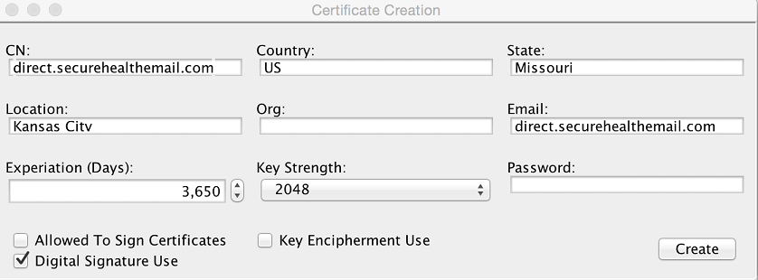
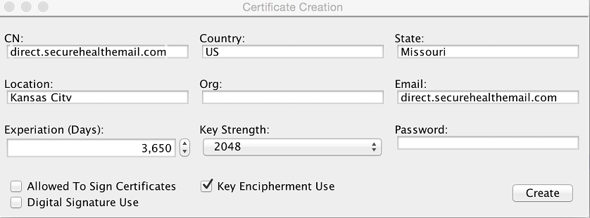

# Single-Use Certificates

Many federal and other government agencies that implement Direct have policies requiring the use of single-use certificates. Single-use certificates are end-entity certificates whose key usage asserts only the key-encipherment or digital-signature bit; dual-use certificates assert both usages in one certificate. Because Direct performs both encryption and digital-signature operations, single-use certificates require two certificates for each domain or email address. Each certificate in a single-use certificate pair contains identical attributes, except for the public/private key pair and the key usage bit.

Although the Bare Metal assembly has supported single-use certificates since version 3.0 via the policy [engine](https://directprojectjavari.github.io/direct-policy/), no documentation existed that explicitly enumerated the steps for using it. This section illustrates, step by step, how to enable single-use certificate support.

## What Does It Mean?

As noted above, single-use certificates are enabled via the policy engine deployed in the agent and DNS servers. But what exactly does it mean to implement single-use certificates? There are two aspects to consider:

1. Issuing single-use certificates to addresses managed by your system
2. Consuming single-use certificates issued by other systems

Let's start with the second aspect: consuming certificates from other systems. By default, the Bare Metal assembly fully supports consuming single-use certificates from other systems because it does not enforce key usage on external certificates, and it uses all valid, trusted discovered certificates for S/MIME operations. This follows a best practice for Direct: produce conservatively, but consume liberally. If your institution's local policy requires enforcing key usage and other policies on external certificates, we'll cover the configuration details later in this section. For now, know that out of the box, Bare Metal has no issues consuming single-use certificates from other systems.

Now, turning to managing your own single-use certificates: the correct usage is to sign messages only with a certificate that asserts the digital-signature key usage bit, and to decrypt messages only with a certificate that asserts the key-encipherment key usage bit (this affects your DNS configuration, which we'll cover later).

## Obtaining Single-Use Certificates

The first step to implementing single-use certificates for your addresses is to obtain the certificates themselves. There are a couple of ways to do this:

* Obtain single-use certificates from a commercial certificate authority (CA) such as DigiCert or IdenTrust.
* Create single-use certificates with the certGen tool.

The first option is most likely required for participation in reputable trust communities. For test purposes, however, we'll briefly illustrate how to create your own single-use certificates.

First, navigate to the /tools directory of the Bare Metal deployment and launch the certGen [tool](https://directprojectjavari.github.io/agent/CertGen). You can either create a new root anchor certificate or use the same one you created during the initial deployment of your Bare Metal installation. Once the anchor is created or loaded from a previously created anchor, click the **Create Leaf Cert** button. Next, go through the same steps you normally would to create a leaf cert, but uncheck the *Key Encipherment Use* option and click the **Create** button.



This creates a certificate (actually three files) that asserts only the digital-signature key usage bit. You now need to create a key-encipherment-only certificate for the same address. Because you'll be using the same attributes as the digital signature certificate, the files created will use the same names — so rename the three digital signature certificate files to something appropriate before creating the key encipherment certificate. Once you've renamed the files, enter the same attributes as the digital signature certificate, but this time uncheck the digital signature option and check the key encipherment option. Finally, click the **Create** button.



Install both certificates using the config-ui workflow for importing certificates; make sure you import the .p12 files, not the DER files.

## Policy Configuration

#### Message Signing

By default, the agent uses all matching certificates in your local certificate store to sign and decrypt messages for a particular sender or recipient. Since single-use certificates consist of two certificates, the agent will, by default, sign with both the digital signature and key encipherment certificates. To enable signing with only the digital signature certificate, you need to create a policy that allows only certificates that assert the digital-signature key usage bit.

Create a file named DigitalSig.pol and add the following line to the file:

```
(X509.TBS.EXTENSION.KeyUsage & 128) > 0
```

Now you need to import the policy file into your system and associate it with a domain. To import and configure policies, you will use a command-line configuration management tool. Which tool you use depends on your deployment model — the commands themselves are identical between the two, only the tool you launch differs:

* **Cloud Native deployment model:** Use the Configuration Manager tool. See [Configuration Manager Tool](cloud-native-deployment#configuration-manager-tool) for where to download it and how to run it (`java -jar config-manager-9.0.0.jar`).
* **Legacy deployment model:** Use the ConfigMgmtConsole tool found in the `<DIRECTHOME>`/ConfigMgmtConsole directory. Launch a command prompt, navigate to the tool's directory, and run the following command to launch the tool:

  *Windows*

  ```
  configMgr
  ```

  *Linux/Unix*

  ```
  ./ConfigMgmtConsole
  ```

When the tool is loaded, import the digital signature policy using the following command, replacing `<pathtoFile>` with the location of the file:

```
IMPORTPOLICY "Digital Signature" <pathtoFile>/DigitalSig.pol
```

Next, create a policy group for outbound messages with the following command:

```
ADDPOLICYGROUP "Outbound Messages"
```

Next, add the policy to the policy group:

```
ADDPOLICYTOGROUP "Digital Signature" "Outbound Messages" PRIVATE_RESOLVER false true
```

This command says to apply the digital signature policy filter to all certificates retrieved from the private certificate resolver (your system's certificate store) for outgoing messages. Effectively, this tells the system to only sign messages with certificates that assert the digital signature key usage bit.

Lastly, you will need to associate this policy group with the domains in your system. Let's say we are managing the direct.securehealthemail.com domain; to apply the policy to the domain, execute the following command:

```
ADDPOLICYGROUPTODOMAIN "Outbound Messages" direct.securehealthemail.com
```

#### DNS Certificate Distribution

By default, the DNS server responds with all certificates that match a DNS query. Because messages should only be encrypted with certificates that assert the key encipherment bit, you will need to configure your DNS server to apply a policy for certificate distribution.

Create a file named KeyEncipher.pol and add the following line to the file:

```
(X509.TBS.EXTENSION.KeyUsage & 32) > 0
```

Next, import the policy into your system with your configuration management tool (Configuration Manager or ConfigMgmtConsole, per the [note above](#message-signing)). Once you've launched the tool, import the policy with the following command, replacing `<pathtoFile>` with the location of the file:

```
IMPORTPOLICY DNSCertPolicy <pathtoFile>/KeyEncipher.pol
```

See the DNS documentation [here](https://directprojectjavari.github.io/dns/) for complete details on configuring the DNS server.

## Additional Local Policies

As previously stated, some systems may wish to enforce additional key usage policies for all S/MIME operations. **NOTE:** Implementing such policies may have an adverse effect on your ability to interoperate with other systems. The following policy option examples assume that the managed domain name is direct.securehealthemail.com and that all previous commands have been executed.

#### Encryption Key Usage

To enforce message encryption with key encipherment certificates only, execute the following command in your configuration management tool:

```
ADDPOLICYTOGROUP "DNSCertPolicy" "Outbound Messages" PUBLIC_RESOLVER false true
```

#### Signature Verification Key Usage

To enforce that incoming messages are signed with digital signature certificates only, execute the following command in your configuration management tool:

```
   ADDPOLICYGROUP "Inbound Messages"
   ADDPOLICYTOGROUP "Digital Signature" "Inbound Messages" TRUST true false
   ADDPOLICYGROUPTODOMAIN "Outbound Messages" <domain name>
```

#### Decryption Key Usage

To enforce that incoming messages encrypted with key encipherment certificates only are decrypted, execute the following command in your configuration management tool:

```
ADDPOLICYTOGROUP "DNSCertPolicy" "Inbound Messages" PRIVATE_RESOLVER true false
```